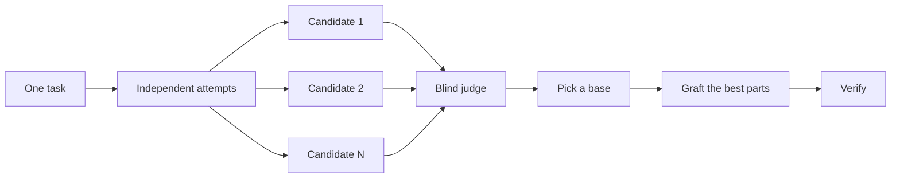

# Design before you write code

One attempt at a hard design locks in its first shape. `$pstack:architect` settles
types and boundaries before implementation. `$pstack:arena` runs several independent
attempts at the same brief and merges the best parts.
`$pstack:interrogate` uses fresh reviewers to try to break the result.
When the job is coverage rather than design synthesis, `$pstack:swarm` fans out slices
or races and aggregates their results.


## Settle the shape with `$pstack:architect`

```text
$pstack:architect design the import pipeline before writing any code. i care most about how callers use it.
```

[`$pstack:architect`](../../skills/architect/SKILL.md) grounds itself first, running `$pstack:how` over the code the design touches and `$pstack:why` when it moves ownership or layers. Then it runs `$pstack:arena` to produce competing design sketches, with the caller's usage written first in each, followed by types, signatures, and a module map.

By default it proceeds straight from the synthesized design into implementation. If you want to see the design first, say so:

```text
$pstack:architect with checkpoint. stop and show me before implementing.
```

## Fan out attempts with `$pstack:arena`

```text
$pstack:arena take my prompt to the arena verbatim. i want to compare their proposals with yours.
```

[`$pstack:arena`](../../skills/arena/SKILL.md) is the general tool underneath. N
subagents attempt the same design or code brief in parallel, each
writing to its own worktree or directory. A fresh read-only judge
scores every candidate against a rubric. The coordinator reads each candidate
end to end, picks a base, grafts in the best ideas from the losers, and verifies
the result.



Ask for more candidates when the decision matters and fewer when it does not:

```text
$pstack:arena this, 5 candidates. the cache key format is expensive to change later.
```

## Cover slices and races with `$pstack:swarm`

```text
$pstack:swarm check every package under packages/ against its check.sh. one worker per package. one report.
```

[`$pstack:swarm`](../../skills/swarm/SKILL.md) fans N workers across independent slices, coverage matrices, gauntlet lanes, exploration partitions, or declared race arms. Each worker gets its own scope and check, then reports `PASS`, `ISSUES`, or `BLOCKED`. The parent waits for the workers and returns one compact report with any gaps or dropouts.

Reach for it when parallelism buys coverage or lets independent checks race. `$pstack:arena` gives every worker the same design or code brief, then picks a base and grafts the best parts. `$pstack:swarm` covers slices or runs a race with a selection rule declared up front. It does not use the base-selection and grafting ceremony.

## Break it with `$pstack:interrogate`

```text
$pstack:interrogate the whole branch, but skeptically. no nitpicks unless it's an actual bug or regression.
```

[`$pstack:interrogate`](../../skills/interrogate/SKILL.md) sends the same diff, intent,
and rubric to three independent reviewers with complementary
focus lenses. The lead checks every finding against the evidence, including
issues raised by only one reviewer, and sorts everything into `Act on`, `Consider`, `Noted`, and `Dismissed`,
with a reason for each dismissal, and applies nothing automatically.

Read the dismissals too. The lead is a pragmatic senior engineer, not an oracle, and you can override it.

## How much design work does a task deserve?

You might be wondering whether every change needs this. No. Most changes need none of it. A rough ladder:

- A small, finished change you're unsure about needs `$pstack:interrogate` alone.
- A change that crosses function boundaries or moves ownership earns `$pstack:architect`, which brings `$pstack:arena` with it.
- A standalone decision where independent attempts would help, like naming, formats, or an algorithm, is `$pstack:arena` directly.
- A coverage matrix, set of parallel checks, or race with declared arms is `$pstack:swarm`.
- A contested design that's expensive to reverse gets `$pstack:architect`, then `$pstack:interrogate` before shipping.

`$pstack:poteto-mode` already applies this ladder. Boundary-crossing work triggers `$pstack:architect` on its own, so you reach for these directly mainly when you want more or less scrutiny than the default.

Next: [Build and clean the change](./05-build-and-clean.md).
